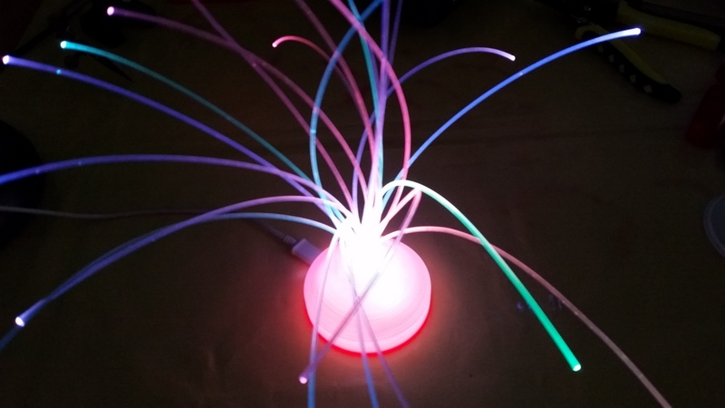
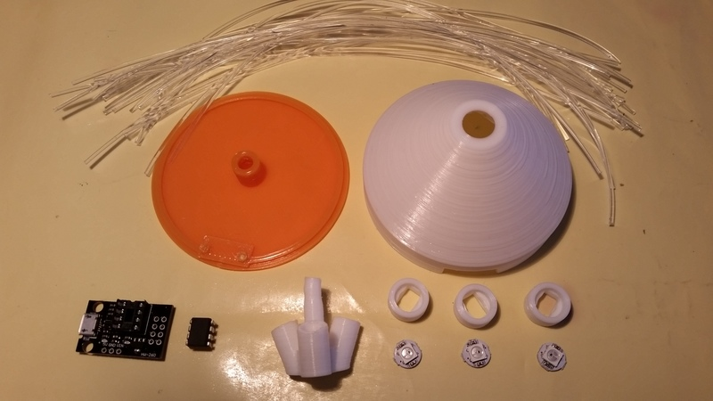
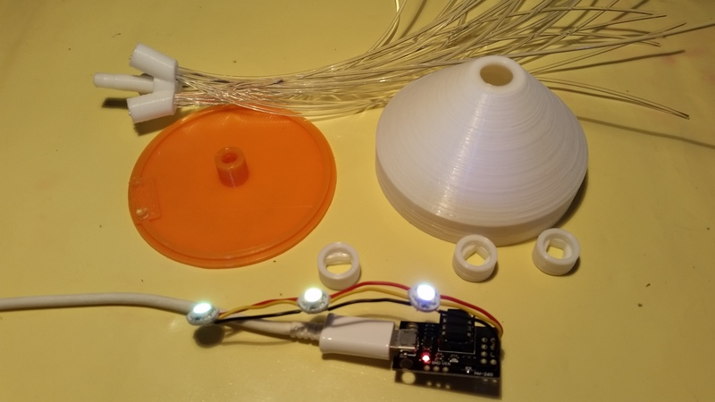
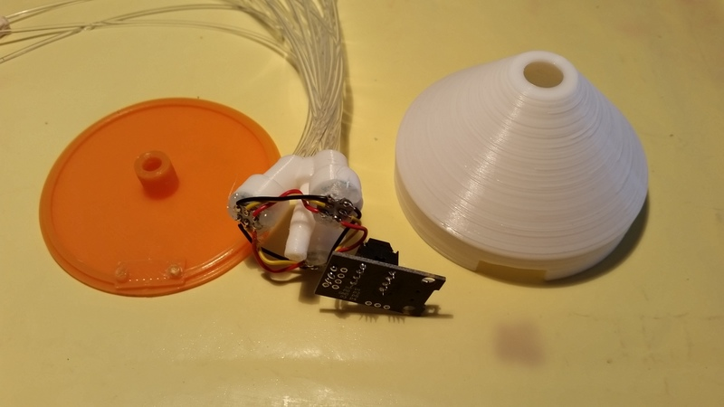
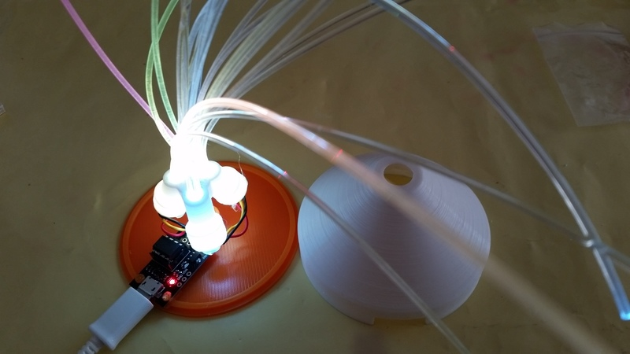
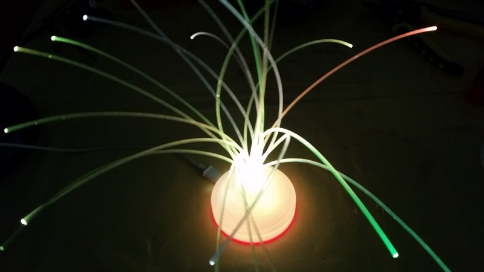

<h1>Fiber Optic Light</h1>

<table>
<tr><th>Date</th><td>2018-02</td></tr>
<tr><th>Tools</th><td>avrdude 6.3, avr-gcc 4.9.2, openscad 2018.02.10.nightly</td></tr>
<tr><th>Keywords</th><td>LED, WS2812, ATtiny45, 3D Print</td></tr>
</table>

<h2>Introduction</h2>

This is a color changing Fiber Optic Light powered by an USB connector. It uses 3 WS2812 LEDs and an ATtiny45/ATtiny85 or Arduino Uno as controller.

The WS2812 LEDs are not very bright, the light only looks good in a dark environment.

<h2>License</h2>

Software: <a href="LICENSE.md">MIT License</a> 
Hardware: <a href="http://creativecommons.org/licenses/by/4.0/">CC Attribution</a>

<h2>Hardware Configuration</h2>

<table>
  <tr><th></th><th>ATtiny45</th><th>Atmega8</th><th>Arduino</th></tr>
  <tr><th>Voltage</th><td>5V</td><td>5V</td><td>5V</td></tr>
  <tr><th>Current</th><td>0.1A</td><td>0.1A</td><td>0.2A</td></tr>
  <tr><th>WS2812 Din</th><td>Pin 5 (port B0)</td><td>Pin 16 (port B2)</td><td>Pin D10</td></tr>
</table>

<h2>Compile &amp; Upload the Software</h2>
You can use the provided hex files or compile them yourself. Check the settings in the source/Makefile (paths and variables 'OS', 'MCU' and PROG').
<ul>
  <li>ATtiny45
    <pre>
      cd source
      make Upload Fuses (if not using micronucleus)
      make UploadMN     (if using micronucleus)
    </pre>
  </li>
  <li>ATmega8
    <pre>
      cd source
      make Upload Fuses
    </pre>
  </li>
  <li>Arduino
    <pre>
      cd source
      make Upload
    </pre>
  </li>
</ul>

<h2>Generate the STL files</h2>
You can download the STL files from <a href="https://www.thingiverse.com/thing:2798190">Thingiverse</a> or build them yourself. You can change the dimensios of the light by adjusting the values at the top of the scad file. 
Check the settings in the hardware/Makefile
<pre>
  cd hardware
  make
</pre>

Use your favorite slicer and print the Top, Bottom, Center and 3x LED Holder parts.

<h2>Assemble the Light</h2>
Click on the images for bigger versions.
<ol>
  <li>
    
    

    Get all the parts:
    <ul>
      <li>Fiber Optic Cable cut to ~20cm long pieces (I use the side glowing type)</li>
      <li>The 3D printed parts: Bottom, Top, Center and 3x LED Holder</li>
      <li>3 x WS2812B on PCB</li>
      <li>ATtiny development board with USB connector</li>
      <li>ATtiny45/ATtiny85</li>
      <li>alternatively an Arduino or ATmega8</li>
    </ul>
    I use an ATtiny85 with <a href="https://github.com/micronucleus/micronucleus">Micronucleus</a> bootloader. The ATtiny45 hex file runs on the ATtiny85 as well. The advantage is that new hex files can be uploaded via USB cable. The drawback is that it takes 6 seconds after power up until the light shows the animation because the bootloader waits for commands.
    

  </li>
  <li>
    
    

      <ul>
        <li>Insert the fibers into the Center part</li>
        <li>Add the ATtiny45 to the development board</li>
        <li>Solder the WS2812Bs together and attach them to the development board or Arduino (see above for pin number)</li>
        <li>Add an USB power cable for a first check</li>
      </ul>
    

  </li>
  <li>
    
    

      <ul>
        <li>Glue the WS2812Bs to the LED Holders</li>
        <li>Stick the LED Holders to the Center part</li>
      </ul>
    

  </li>
  <li>
    
    

      <ul>
        <li>Attach the Center part to the Bottom part (I had to sand it to make it fit)</li>
        <li>Clip the development board to the Bottom part</li>
        <li>Do another test</li>
      </ul>
    

  </li>
  <li>
    
    

      <ul>
        <li>Stick some insulating tape on the power LED of the development board</li>
        <li>Attach the Top part</li>
        <li>Attach the USB power cable</li>
      </ul>
    

  </li>
</ol>

<h2>Links</h2>
<ul>
  <li>https://github.com/micronucleus/micronucleus</li>
</ul>
<ul>
  <li>http://www.atmel.com/Images/Atmel-2586-AVR-8-bit-Microcontroller-ATtiny25-ATtiny45-ATtiny85_Datasheet.pdf</li>
  <li>http://www.atmel.com/Images/Atmel-2486-8-bit-AVR-microcontroller-ATmega8_L_datasheet.pdf</li>
  <li>http://www.atmel.com/images/atmel-8159-8-bit-avr-microcontroller-atmega8a_datasheet.pdf</li>
  <li>http://www.atmel.com/images/Atmel-8271-8-bit-AVR-Microcontroller-ATmega48A-48PA-88A-88PA-168A-168PA-328-328P_datasheet_Complete.pdf</li>
  <li>http://www.atmel.com/Images/Atmel-0856-AVR-Instruction-Set-Manual.pdf</li>
</ul>
<ul>
  <li>http://eleccelerator.com/fusecalc/fusecalc.php?chip=atmega8&LOW=E4&HIGH=D9
</ul>
